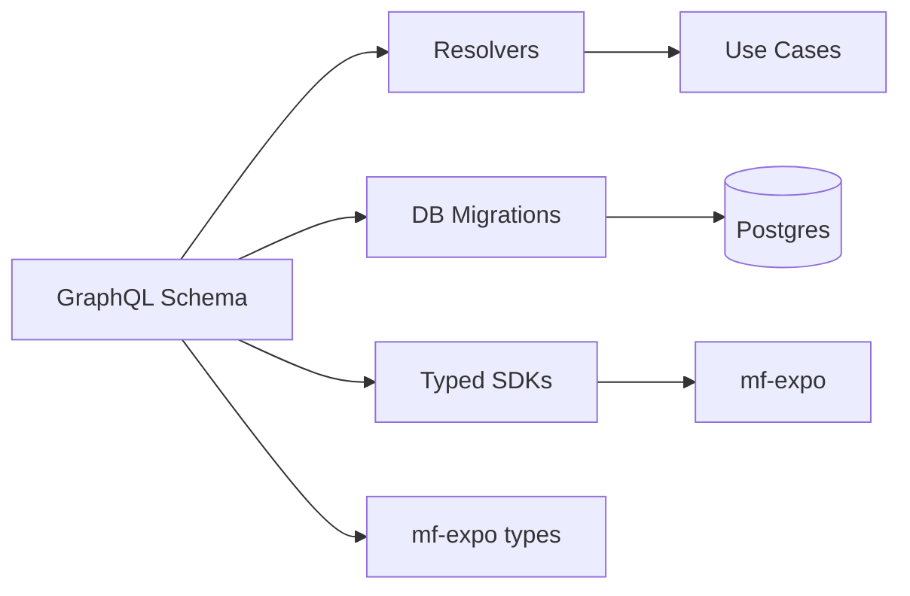
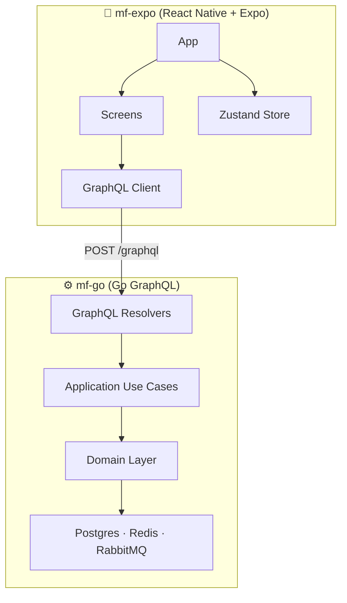
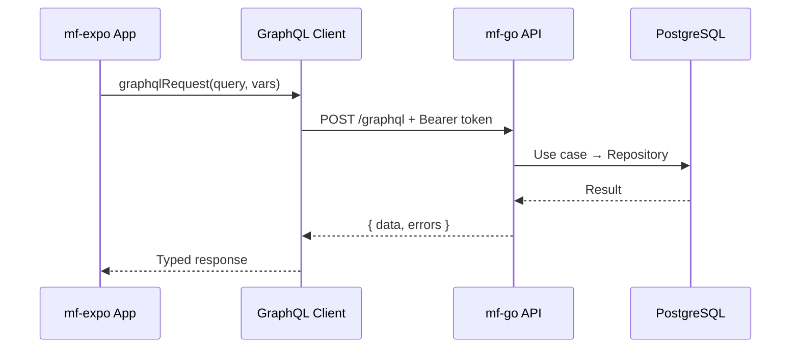
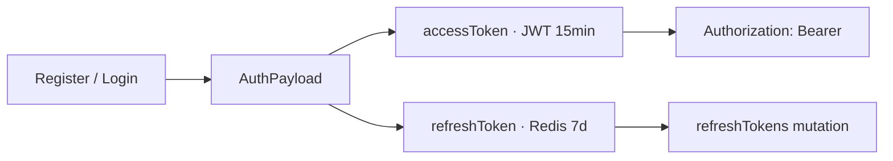
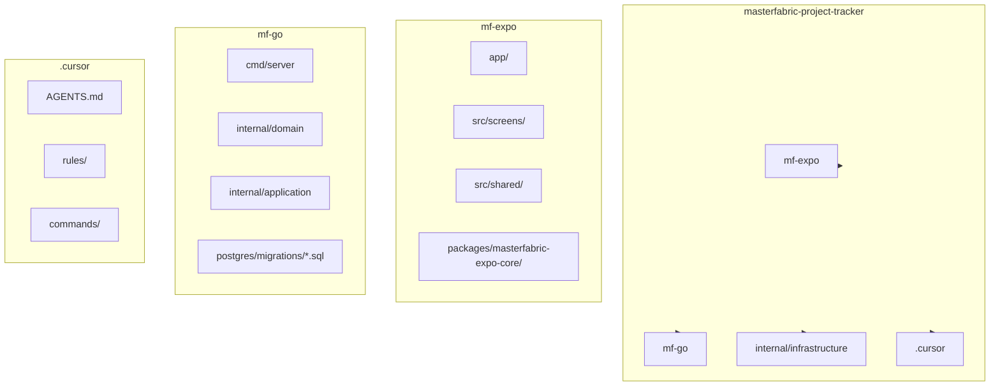

# MasterFabric Project Tracker [AI Monorepo]

> **Production-ready** full-stack mobile monorepo — React Native + Expo + Go GraphQL. Built for **AI-assisted development** with Cursor, TypeScript, and Clean Architecture.

[](https://www.typescriptlang.org/)
[](https://go.dev/)
[](https://graphql.org/)
[](https://expo.dev/)

---

## What is an AI Monorepo?

An **AI Monorepo** is a codebase designed from the ground up for **AI pair programming** (Cursor, GitHub Copilot, Claude, etc.):

- **`.cursor/rules/`** — Project conventions, patterns, and context so AI understands your architecture
- **`.cursor/AGENTS.md`** — Conventions for AI agents: structure, key paths, cross-project flows
- **Single source of truth** — GraphQL schema, migrations, and typed APIs reduce AI hallucination
- **Consistent patterns** — DDD, Clean Architecture, and predictable naming help AI generate correct code

Think of it as **documentation that AI actually uses** — not dusty wikis, but rules that shape every suggestion.

---

## AI-Native Development & Model-Based Full-Stack

### AI-Native Development

**AI-native** means the project is structured so that **LLMs (large language models) can reason about it effectively**. Unlike legacy codebases where AI struggles with inconsistent patterns and hidden assumptions, an AI-native codebase:

| Principle | How This Repo Does It |
|-----------|------------------------|
| **Explicit structure** | Clear `domain/` → `application/` → `infrastructure/` layers; AI knows where to put code |
| **Schema-first** | GraphQL schema is the source of truth; models and types flow from it |
| **Predictable naming** | `Execute(ctx, req) → (resp, error)`, `CreateTodoInput`, `NotificationPayload` — AI infers patterns |
| **Embedded context** | `.cursor/rules/` and `.cursor/AGENTS.md` are loaded by Cursor; AI reads them before suggesting |

### Model-Based Full-Stack

**Model-based** means the **domain model drives the entire stack** — not scattered docs or tribal knowledge:



- **One schema** → resolvers, migrations, TypeScript types, and generated SDKs stay in sync
- **Add a field** → run `make generate-all` → backend, DB, and client update together
- **No drift** — the model is the contract; AI and humans both reason from the same source

### Full-Stack Solutions

This repo is a **full-stack solution** — client and server in one place, wired for AI-assisted iteration:

- **mf-expo** (mobile) and **mf-go** (backend) share the same GraphQL contract
- **Cross-project changes** are documented: add schema → generate → wire resolver → add client call
- **Postman collection** covers the full API surface; run it to validate end-to-end
- **Versioned migrations** — numbered SQL in `mf-go/internal/infrastructure/postgres/migrations/` (applied on server start); schema evolves without drift

Together: **AI-native** (structured for LLMs) + **model-based** (schema-driven) + **full-stack** (client + server + DB in one repo) = a codebase where AI can help you ship faster without breaking things.

---

## Architecture



### Data Flow



### Auth Flow



---

## Projects

| Project | Stack | Description |
|---------|-------|-------------|
| **mf-expo** | React Native, Expo SDK 54, TypeScript, Zustand, React Query | Cross-platform app (iOS, Android, Web) — todos (local + server), auth, onboarding, splash |
| **mf-go** | Go 1.22+ (CI pins **1.25.x**), gqlgen, chi, PostgreSQL, Redis, RabbitMQ | GraphQL API — Auth, User, Settings, Device, Notifications, Todos, Organizations, Admin, realtime |

---

## Recent updates

Highlights from active development (see `git log` for the full history):

| Area | What shipped |
|------|----------------|
| **mf-expo** | **Draggable todo list**; **local todos** alongside server-backed todos; refreshed **splash**, **onboarding**, and **auth** flows; **branding** and home/profile polish; **unified text/color** handling across components |
| **mf-go** | **Realtime** hardening; **RabbitMQ** reliability; **OTP** (optional 2FA), delivery via **admin panel**, **SMTP** (Mailpit in full Docker stack), **WhatsApp Cloud API**, **Telegram Bot API**; **GraphQL depth/complexity** limits, **security headers**, **login rate limits**, JWT **`jti`**, Redis **`requirepass`** in compose; **`make security-scan`**; **SECURITY.md**; versioned **migrations** |
| **CI** | **Path-filtered** jobs — Go tests + **`govulncheck`** + **Trivy** (HIGH/CRITICAL) only when `mf-go/`, `infra/`, or workflows change; **Expo lint + type-check** when `mf-expo/` changes |
| **Deploy** | **`Deploy mf-go to Azure Container Apps`** workflow: OIDC to Azure, build/push image to ACR, update Container App, **`/health` gate**, job summary prints a **rollback** `az containerapp update … --image` command; **push deploy waits for a successful CI run** on the same commit |
| **Infra** | **`infra/mf-go-container-app.bicep`** — Azure Container Apps + **Redis URL**, Postgres DSN, JWT; **`infra/deploy.sh`** — example `az deployment group create` for first-time / manual provisioning |

---

## Quick Start

### CLI (recommended)

```bash
npm install
npm run start-all          # Interactive menu; stays open — Ctrl+C = same as stop-all
npm run start-all:detach   # Start then exit (use another terminal for npm run stop-all)
npm run start-all:ios      # Expo uses `npm run ios` (simulator / device)
npm run start-all:live     # Expo against live backend (no mf-go)
npm run start-all:live:ios # Live + iOS simulator
# Set prod URL in local.env (copy from local.env.example). Override: MASTERFABRIC_LIVE_GRAPHQL_URL=https://your-url/graphql npm run start-all:live
# Add --detach after any start script if you need the old “exit immediately” behavior, e.g. npm run start-all:ios -- --detach
npm run stop-all           # Stop Docker + tracked processes + Expo (same as Ctrl+C in start-all)
```

The dev CLI **sends SIGTERM to listeners** on the usual mf-go / Expo ports **before** starting Docker or servers (reduces “address already in use” from stale runs). Set **`MF_CLI_SKIP_PORT_FREE=1`** if you need to skip that.

After **`start-all`**, press **Ctrl+C** in that same terminal to tear down (or run **`npm run stop-all`** from any shell).

Choosing **all** on **macOS** (and on Linux with a desktop / Windows): **mf-go** and **mf-expo** open in **new terminal windows**; Docker infra + **pgAdmin** run **detached** in the background. On headless Linux, **all** falls back to background processes only.

When starting **mf-go** or **all**, **pgAdmin** (Postgres UI) runs in Docker at `http://localhost:5001` (included in `make docker-infra`). See **`mf-go/deployments/pgadmin/README.md`** for login and the pre-registered server.

### Manual

**1. Local env (required)**

GraphQL URLs are loaded from `local.env` at repo root (gitignored). Copy the example and fill in:

```bash
cp local.env.example local.env
# Edit local.env:
#   EXPO_PUBLIC_DEV_GRAPHQL_URL=http://localhost:8080/graphql
#   EXPO_PUBLIC_GRAPHQL_URL=https://your-prod-url/graphql
```

**2. Backend**

```bash
cd mf-go
make docker-infra   # Postgres, Redis, RabbitMQ, pgAdmin, Mailpit (no app container)
# OTP email dev: Mailpit inbox http://localhost:8025 — set SMTP_* + OTP_DELIVERY=email in mf-go/.env (see .env.example)
cp .env.example .env
# If Redis from deployments/docker-compose.yml is running, it uses --requirepass (see compose file).
# Set REDIS_PASSWORD in mf-go/.env to match (e.g. devredis) or /health/ready will fail with Redis NOAUTH.
make run
```

→ `http://localhost:8080/graphql`

**3. App (mobile)**

```bash
cd mf-expo
npm install
cp .env.example .env.development
npm start
```

Press `i` (iOS), `a` (Android), or scan QR with Expo Go.

**4. Connect (mobile)**

Dev uses `EXPO_PUBLIC_DEV_GRAPHQL_URL` from `local.env` (default `http://localhost:8080/graphql`). Triple-tap the app bar title to switch Dev ↔ Prod at runtime.

### Live backend

Set `EXPO_PUBLIC_GRAPHQL_URL` in `local.env` to your production GraphQL URL.

**Start Expo against live:**
```bash
npm run start-all:live      # from root (requires local.env)
# or
cd mf-expo && npm run start:live
```

**Test live endpoint (curl):** Use your prod URL from `local.env`.

---

## Structure



---

## Database

Schema is applied by **golang-migrate** from `mf-go/internal/infrastructure/postgres/migrations/` (`001` … `007+` — OTP codes, settings flags, Telegram chat id, etc.). The server runs migrations on startup.

| Domain | Tables (representative) |
|--------|-------------------------|
| **IAM** | users (+ extended profile, `telegram_chat_id`) |
| **Settings** | user_settings, app_settings |
| **Profile** | user_addresses, user_devices |
| **Collaboration** | organizations, organization_members, organization_invitations |
| **Tasks** | user_todos |
| **Notifications** | notifications, notification_reads |
| **OTP** | otp_codes |

---

## After GraphQL Schema Changes

```bash
cd mf-go && make generate-all
```

Regenerates gqlgen resolvers and SDKs. **Never edit `sdk/` by hand.**

---

## CI, quality, and deployment

This repo does not include GitHub Actions workflows. Run checks locally (or wire your own CI) before pushing.

**mf-go:** `cd mf-go && make test` (and `make security-scan`, `make lint` as needed; see [mf-go README](mf-go/README.md)).

**mf-expo:** `cd mf-expo && npm ci && npm run lint && npm run type-check`.

**Azure Container Apps:** use **`infra/deploy.sh`** (requires `az` CLI, `DATABASE_DSN`, **`REDIS_URL`**, `JWT_SECRET`, ACR/RG settings) with **`infra/mf-go-container-app.bicep`** to stand up or align the Container App and secrets.

---

## Security

- **Never commit** `.env`, `.env.development`, `.env.production`, or `local.env` — API keys, tokens, secrets, backend URLs.
- Copy **`local.env.example`** → `local.env` (repo root) for Expo dev/prod GraphQL URLs.
- Copy **`mf-go/.env.example`** → `mf-go/.env` for the API; see **[mf-go/docs/SECURITY.md](mf-go/docs/SECURITY.md)** for production (JWT, Redis, CORS, OTP/SMTP/WhatsApp/Telegram). **Local dev:** if Redis uses a password (Docker Compose `requirepass`), set **`REDIS_PASSWORD`** in `mf-go/.env` to the same value or readiness checks fail.
- Root **[`.env.example`](.env.example)** summarizes where each package’s env files live.
- Copy **`mf-expo/.env.example`** → `mf-expo/.env.development` (and friends) for `EXPO_PUBLIC_*`.
- `.gitignore` excludes env files and sensitive artifacts.

---

## Docs

- [mf-expo README](mf-expo/README.md) — app structure, env, scripts
- [mf-go README](mf-go/README.md) — GraphQL reference, Postman, Makefile, **OTP delivery**, deployment
- [mf-go/docs/SECURITY.md](mf-go/docs/SECURITY.md) — production checklist, GraphQL hardening, OTP channels
- [mf-go/docs/OTP_CONFIGURATION.md](mf-go/docs/OTP_CONFIGURATION.md) — enable/disable OTP delivery, any SMTP provider, per-user `otp_enabled`
- [.cursor/AGENTS.md](.cursor/AGENTS.md) — AI agent conventions
- [infra/mf-go-container-app.bicep](infra/mf-go-container-app.bicep) — Azure Container Apps template (Postgres, **Redis**, JWT, ACR)
- [infra/deploy.sh](infra/deploy.sh) — Example Azure group deployment script
