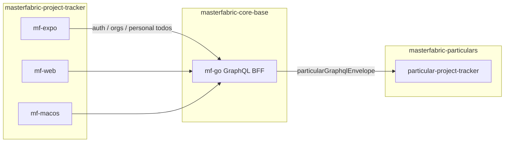

# MasterFabric Project Tracker

> Cross-platform **clients** for project tracking — React Native (Expo), Next.js web, and macOS companions. Backend GraphQL and domain Particulars live in sibling repos.

[](https://www.typescriptlang.org/)
[](https://graphql.org/)
[](https://expo.dev/)

---

## Multi-repo architecture



| Repo | Role |
|------|------|
| **masterfabric-project-tracker** (this repo) | Client apps: `mf-expo`, `mf-web`, `mf-macos` |
| **[masterfabric-core-base](https://github.com/masterfabric/masterfabric-core-base)** | Platform GraphQL (`mf-go`), admin UI (`mf-core`), auth, orgs, personal todos |
| **[masterfabric-particulars](https://github.com/masterfabric/masterfabric-particulars)** | Domain Particulars — org projects / todos / purchases in `particular-project-tracker` |

Traffic is always **client → core-base mf-go → Particular**. This repo no longer owns an in-tree `mf-go`.

Recommended sibling layout:

```
Projects/
├── masterfabric-core-base/
├── masterfabric-particulars/
└── masterfabric-project-tracker/   ← you are here
```

---

## Projects in this repo

| Project | Stack | Description |
|---------|-------|-------------|
| **mf-expo** | React Native, Expo SDK 54, TypeScript, Zustand | Mobile app — todos, auth, org projects (via Particular hop) |
| **mf-web** | Next.js, React, Tailwind | Linear-style web tracker |
| **mf-macos** | SwiftUI, MenuBarExtra, WidgetKit | macOS menu bar + widgets |

---

## Quick Start

### 1. Backend (sibling repos)

**core-base mf-go** (Auth, orgs, personal todos, Particular hop):

```bash
cd ../masterfabric-core-base/mf-go
make docker-infra
make run
# → http://localhost:8080/graphql
```

**particular-project-tracker** (org projects / todos / purchases):

```bash
cd ../masterfabric-particulars
./scripts/setup-project-tracker.sh --start
# optional: ./scripts/print-mf-project-tracker-env.sh
```

See particulars `README.md` and `particular-project-tracker/README.md` for JWT secret alignment and registration.

### 2. Client env

```bash
cp local.env.example local.env
# EXPO_PUBLIC_DEV_GRAPHQL_URL=http://localhost:8080/graphql
# EXPO_PUBLIC_GRAPHQL_URL=https://your-prod-url/graphql
# EXPO_PUBLIC_MF_PROJECT_TRACKER_PARTICULAR=project_tracker
```

### 3. Start Expo (this repo)

```bash
npm install
npm run start-all          # mf-expo only; Ctrl+C = stop-all
npm run start-all:detach   # Start then exit
npm run start-all:ios      # Expo `npm run ios`
npm run ios:sim            # Dedicated **MF Project Tracker** simulator → core-base GraphQL + Particular :39205
npm run start-all:live     # Expo against EXPO_PUBLIC_GRAPHQL_URL
npm run stop-all           # Stop Expo / Metro
```

Or manually:

```bash
cd mf-expo
npm install
cp .env.example .env.development
npm start
```

The root CLI **does not** start mf-go or Docker. Point GraphQL at core-base; keep Particular running when testing org projects.

---

## AI-native client repo

- **`.cursor/rules/`** — conventions for mf-expo and multi-repo boundaries
- **`.cursor/AGENTS.md`** — agent overview: clients here; GraphQL in core-base; domain in particulars

Schema changes for platform APIs belong in **core-base**; project-tracker domain schema belongs in **particular-project-tracker**. Update this client’s `mf-go-api.ts` / envelope helpers to match.

---

## Structure

```
masterfabric-project-tracker/
├── mf-expo/          # React Native + Expo
├── mf-web/           # Next.js tracker UI
├── mf-macos/         # SwiftUI companion
├── scripts/          # Dev CLI (Expo start/stop)
├── local.env.example
└── .cursor/          # rules, commands, AGENTS.md
```

---

## Security

- **Never commit** `.env`, `.env.development`, `.env.production`, or `local.env`.
- Copy **`local.env.example`** → `local.env` for GraphQL URLs.
- Backend secrets live in **core-base** `mf-go/.env` and particulars service env — not in this repo.
- Root **[`.env.example`](.env.example)** summarizes where each package’s env files live.

---

## Docs

- [mf-expo README](mf-expo/README.md) — app structure, env, scripts
- [mf-web README](mf-web/README.md) — Linear-style web tracker
- [mf-macos README](mf-macos/README.md) — macOS menu bar + WidgetKit companion
- [.cursor/AGENTS.md](.cursor/AGENTS.md) — AI agent conventions
- Sibling: **masterfabric-core-base** — mf-go GraphQL, Postman, migrations
- Sibling: **masterfabric-particulars** — `particular-project-tracker`, `scripts/setup-project-tracker.sh`
