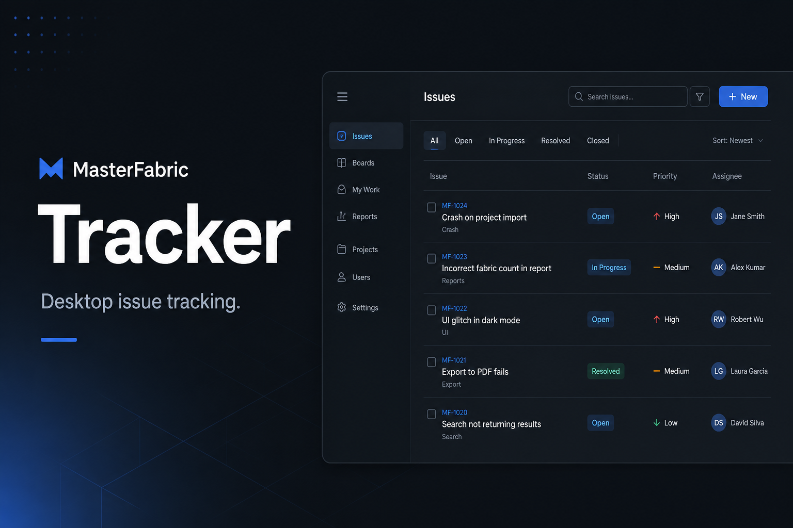
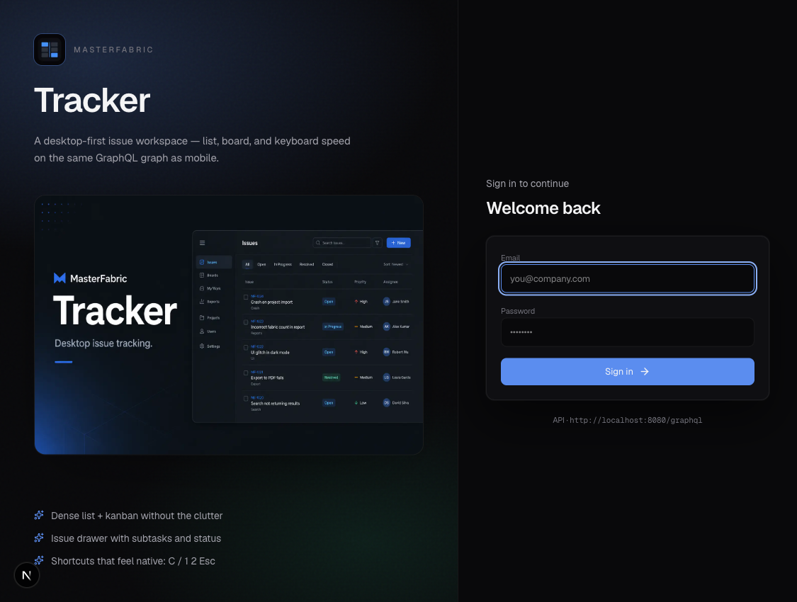
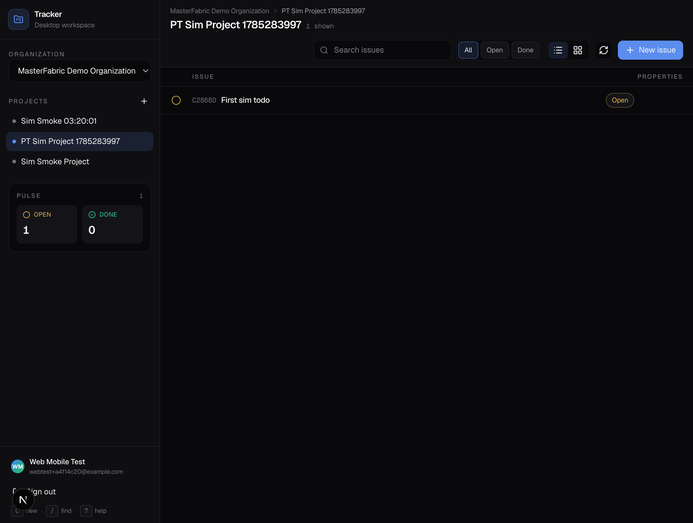
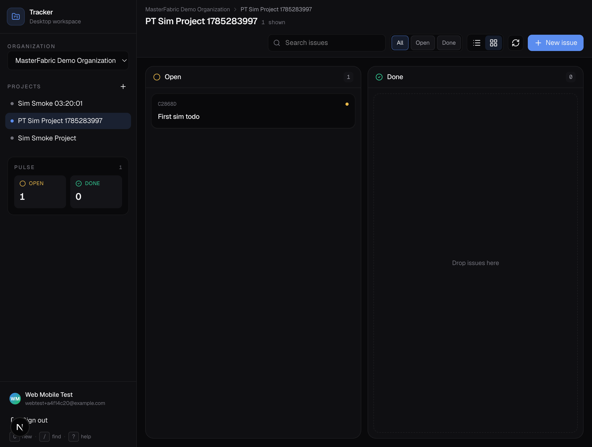
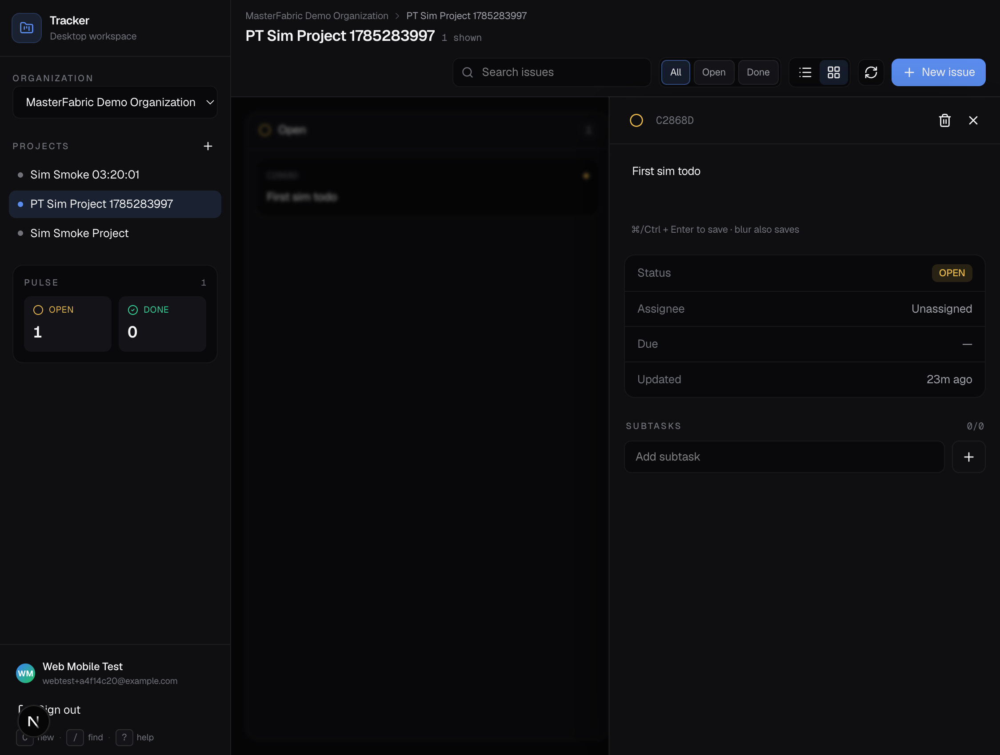

# mf-web — MasterFabric Tracker (web)

Linear-speed issue tracking for MasterFabric teams. Talks to the same **mf-go GraphQL** API as `mf-expo` and `mf-macos`, with org projects/todos/purchases via **`particularGraphqlEnvelope`** → particular-project-tracker.



## Screenshots

| Login | List |
| --- | --- |
|  |  |

| Board | Issue drawer |
| --- | --- |
|  |  |

Brand assets in `public/`: `tracker-mark.png`, `og.png`.

## Features (parity with mobile tracker)

- Email/password sign-in (OTP when required)
- Create organization + invite members; accept/decline pending invites
- Organization + project switcher; rename / delete project
- Project roster: add/remove members from org members
- **Issues** — list + board, status filters, **assignee filter**, search
- Create issue with **assignee + due**; drawer edits title / due / status / subtasks
- **Purchases** tab — create, status cycle, delete, product link (same validation ideas as mobile)
- **My todos** — personal mf-go todos with due + subtasks
- Keyboard shortcuts: `C` new, `/` search, `1`/`2` views, `Esc` close, `?` help
- Session refresh so mutations survive short-lived access tokens

## Setup

```bash
cd mf-web
cp .env.local.example .env.local
# NEXT_PUBLIC_GRAPHQL_URL=http://localhost:8080/graphql
# NEXT_PUBLIC_MF_BUNDLE_ID=com.masterfabric.monoExpo
# NEXT_PUBLIC_MF_API_KEY=   # optional; X-Bundle-ID alone works when allow_bundle_id_identity
# NEXT_PUBLIC_MF_PROJECT_TRACKER_PARTICULAR=project_tracker
npm install
npm run dev
```

Open [http://localhost:3000](http://localhost:3000). Start **core-base mf-go** and **particular-project-tracker** first.

### Client app ↔ organization link (required)

Org-scoped Particular calls (`particularGraphqlEnvelope` → `project_tracker`) require **`client_apps.organization_id`** on the app identity you send (`NEXT_PUBLIC_MF_BUNDLE_ID` / API key). If that column is NULL, mf-go returns **`CLIENT_APP_ORGANIZATION_NOT_LINKED`**.

**Fix in MasterFabric Core:** Apps → open `com.masterfabric.monoExpo` → set **Organization** to your tenant (local Demo id `0b9b7f9e-4c96-4061-b432-66487809453c`).

**Local SQL (dev only):**

```sql
UPDATE client_apps
SET organization_id = '0b9b7f9e-4c96-4061-b432-66487809453c'
WHERE bundle_id = 'com.masterfabric.monoExpo' AND organization_id IS NULL;
```

mf-go **dev seed** re-links this bundle to the Demo org on restart (same helper that links Academy). Confirm grants still include `project.tracker.graphql` for that app after register/setup scripts.

## Stack

- Next.js 16 (App Router) + React 19 + Tailwind CSS 4
- Client-side GraphQL via `fetch` (Bearer token + `X-Bundle-ID` / optional `X-API-Key`)

## Notes

- Project todo statuses are **OPEN** / **DONE** only; assignee is set at create time (Particular update API has no assignee field yet).
- Admin / org chat / notifications stay mobile-first for now.
